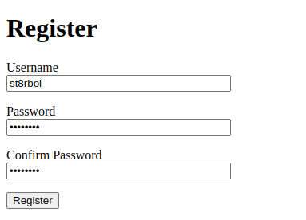

# 📝 Task Manager

Task Manager — это веб-приложение для управления личными задачами. Проект реализован на Flask с использованием PostgreSQL, SQLAlchemy и Flask-Login, упакован в Docker-контейнеры для удобного запуска и деплоя.

## 🚀 Возможности

- Регистрация и авторизация пользователей
- Добавление, редактирование и удаление задач
- Фильтрация задач по статусу: все / выполненные / в процессе
- Сохраняет данные в PostgreSQL
- Поддержка Docker

## 📸 Примеры интерфейса

  

  

## ⚙️ Стек технологий

- Python
- Flask
- SQLAlchemy
- PostgreSQL
- Flask-Login
- Docker + docker-compose
- Jinja2

